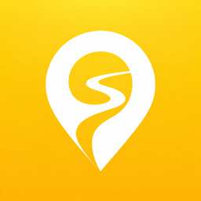
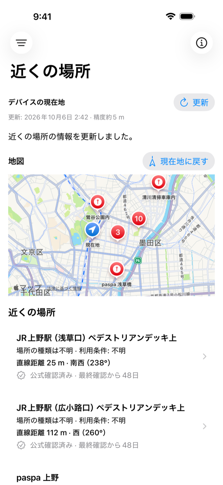
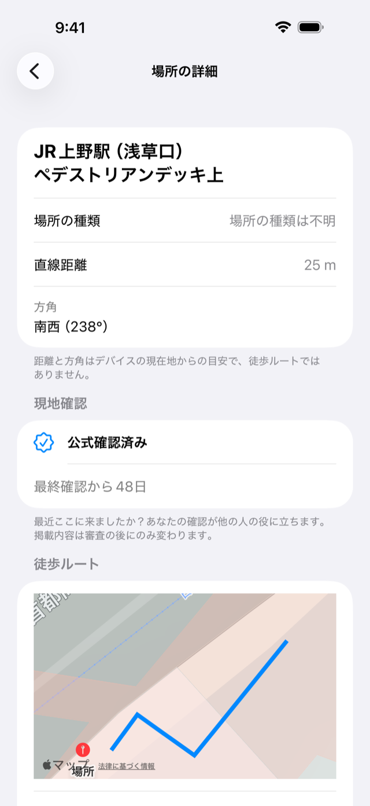
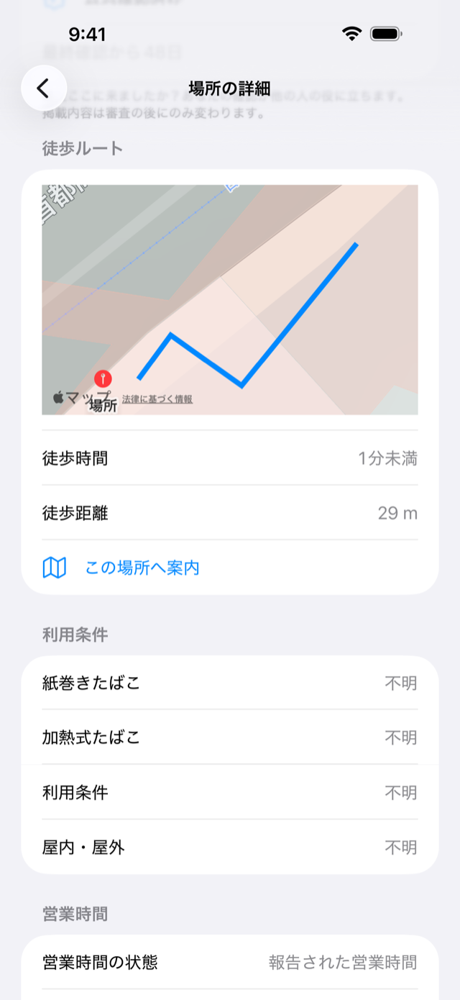
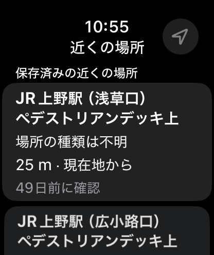
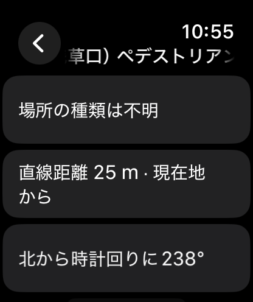

  

# MannerPath

**確認された喫煙可能場所を、すばやく探す。**

iPhone + Apple Watchのための、喫煙可能場所・灰皿を探すアプリです。近くの場所から徒歩ルートまで、確認根拠と位置の精度を見ながら選べます。

**v1 Release Candidate — App Store提出に向けて準備中**

iOS 18以降 / watchOS 11以降。対応地域は順次拡大中です。

## MannerPathとは

喫煙が認められている場所や、存在が確認された灰皿を地図とリストで探せます。コンビニがあるだけでは登録せず、喫煙場所・灰皿の確認根拠がある場所を掲載します。

喫煙を促進するためではなく、禁止された場所や周囲への配慮が必要な場所での喫煙を避け、適切な場所を見つけるためのアプリです。

## Screenshots

本番データで撮影した実アプリの画面です。

### iPhone

<table>
  <tr>
    <th>近くの場所</th>
    <th>場所の詳細</th>
    <th>徒歩ルート</th>
  </tr>
  <tr>
    <td></td>
    <td></td>
    <td></td>
  </tr>
</table>

### Apple Watch

<table>
  <tr>
    <th>近くの場所</th>
    <th>場所の詳細</th>
  </tr>
  <tr>
    <td></td>
    <td></td>
  </tr>
</table>

## 主な特徴

- **地図とリストで探す** — 近くの場所や目的地周辺を調べ、直線距離・方向を確認。
- **徒歩で向かう** — iPhoneで徒歩ルートを確認。Apple Watchからも案内へアクセス。
- **位置の精度を伝える** — 正確な地点と「この付近」の概略位置を区別して表示。
- **根拠が見える** — 確認根拠、情報の鮮度・信頼度、出典・ライセンス・帰属表示を確認。
- **オフラインでも探す** — 保存済みの場所、距離・方向を利用。徒歩ルートの取得には通信が必要な場合があります。
- **手元からすぐ確認** — Apple WatchとWidgetに対応。

## データについて

現在の本番公開データは **513件 / 承認済みの自治体公式ソース6件**。community由来の公開は **0件** です。全国の場所を網羅しているわけではなく、**対応地域は順次拡大中**です。

店舗・公園・駅などの施設が存在するだけでは、喫煙可能とは判断しません。喫煙場所や灰皿そのものの確認根拠が必要です。MapKitは地図・検索・経路案内に利用し、掲載データの根拠にはしません。OSMはv1の本番データに採用していません。

報告・写真投稿・community公開は現在無効です。データの出典と権利確認は[本番コンテンツ権利監査](docs/PRODUCTION_CONTENT_RIGHTS_AUDIT.md)にまとめています。

## 設計原則

- **確認できた根拠を残す。** 情報の鮮度や信頼度も隠しません。
- **不明は、不明のまま伝える。** 営業時間や対応たばこ種別が不明なら、営業中・対応済みとは表示しません。
- **位置の目安を明示する。** 喫煙場所の存在が確認できても、正確な位置が不明なら「この付近」と伝えます。
- **正確なGPS座標をbackendへ送らない。** 距離や並び順は端末内で計算し、MannerPath backendには地域のタイルIDでデータを要求します。タイルIDも地域情報を含みます。詳細は[プライバシーポリシー](https://kounishiyuuki.github.io/MannerPath/privacy/)へ。
- **出典と利用条件を見えるようにする。** ライセンス・帰属情報をアプリ内で確認できます。

## Tech Stack

| 領域 | 技術 |
| --- | --- |
| iPhone / Apple Watch | Swift 6 / SwiftUI · iOS 18+ / watchOS 11+ |
| 地図・位置情報 | MapKit / Core Location |
| Widget・端末間連携 | WidgetKit / App Intents / WatchConnectivity |
| ローカル保存 | GRDB（iPhone）/ Codableスナップショット（Watch）|
| API・データベース | Cloudflare Workers / TypeScript / Hono / D1 |

詳しくは[技術スタック](docs/TECH_STACK.md)へ。

## 現在の開発状況

**v1 Release Candidate / App Store submission readiness** の段階です。

- **完了：** 本番backend稼働、本番API接続、正式App Icon統合、archive事前検証、iPhone / Watch RC。
- **残り：** Developer Program・provisioning確認、署名付きarchive、TestFlight、実機確認、最終的な権利・プライバシー確認とApp Store提出。

現在は配信前です。残りの確認項目は[リリースチェックリスト](docs/RELEASE_CHECKLIST.md)と[Apple配布準備](docs/APPLE_DISTRIBUTION_READINESS.md)へ。iPadネイティブ対応はv1.x以降を予定しています。

## 今後

- UI / UXの改善とAPIの堅牢化。
- 自治体などの公式ソースを増やし、全国の対応地域を順次拡大。
- 報告・community機能は、法務面の確認とmaintainerの承認後に検討。

## Documentation

| ドキュメント | 内容 |
| --- | --- |
| [プロダクト要件](docs/PRODUCT_REQUIREMENTS.md) | 目的・機能・対象プラットフォーム |
| [仕様](docs/SPECIFICATION.md) | データと表示で守るルール |
| [デザイン](docs/DESIGN.md) | iPhone / Watch / Widgetの画面方針 |
| [アーキテクチャ](docs/ARCHITECTURE.md) | アプリとbackendの構成 |
| [技術スタック](docs/TECH_STACK.md) | 採用技術と選定理由 |
| [リリースチェックリスト](docs/RELEASE_CHECKLIST.md) | リリースに向けた検証状況 |
